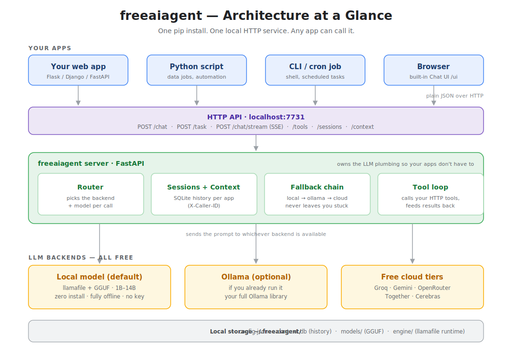
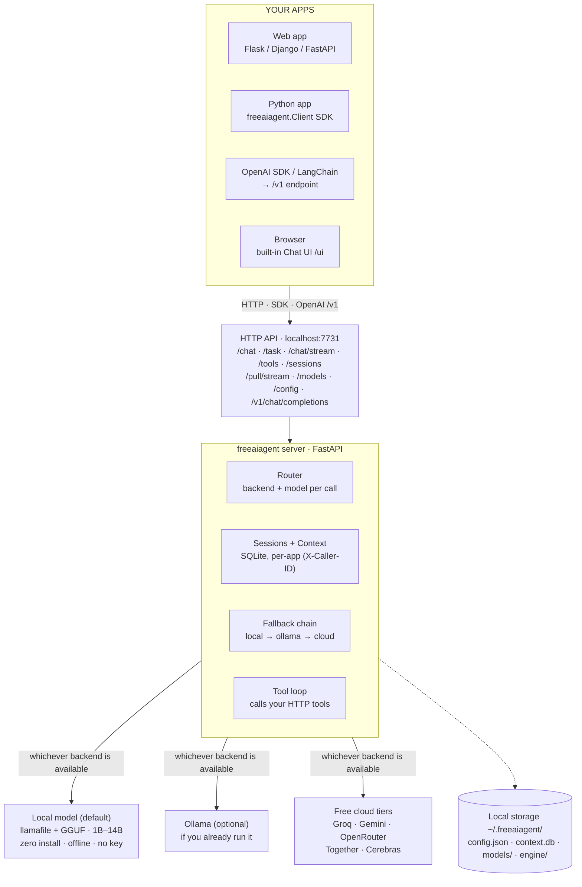

# freeaiagent — free local AI agent, zero setup

[](https://pypi.org/project/freeaiagent/)
[](https://pepy.tech/project/freeaiagent)
[](https://pypi.org/project/freeaiagent/)
[](https://pypi.org/project/freeaiagent/)
[](https://github.com/shubham10divakar/freeaiagent/blob/main/LICENSE)
[](https://github.com/shubham10divakar/freeaiagent)

Run a local AI agent with one `pip install`. No OpenAI key, no cloud required — it downloads and runs a local LLM for you, or connects to free cloud tiers (Groq, Gemini, OpenRouter). Any app calls it over HTTP with no LLM code on its side.

Runs as a persistent HTTP server on `localhost:7731`. Stores conversation history in SQLite. Any app — script, CLI tool, personal project — can delegate tasks to it with a single HTTP call, no LLM code required on the caller's side.

Built on free LLM backends:
- **Local, zero-install** — downloads and runs a local GGUF model for you via llamafile (no Ollama, no keys). Supports 1B–14B models.
- **In-process (optional)** — load a GGUF straight into Python via `llama-cpp-python`, no subprocess or local server.
- **Ollama** — local, no key, if you already use it.
- **Free cloud tiers** — Groq, Google Gemini, OpenRouter, Together, Cerebras (bring a free API key).

Plus **streaming**, **tool/function calling**, **per-app sessions**, **summarizing & per-backend context windows**, and **ensemble inference** out of the box.

Call it from Python with the built-in **`Client` SDK** (one import, live download progress, no HTTP boilerplate), or point any **OpenAI SDK / LangChain / LlamaIndex** client at its drop-in `/v1` endpoint. Install it as an **auto-start service** so it's always available.

## Architecture



Your apps talk to one local HTTP service — over plain HTTP, the Python `Client` SDK,
or the OpenAI-compatible `/v1` API. freeaiagent owns model routing, persistent context,
the automatic fallback chain, and tool calls — so no app needs any LLM code, keys, or
model management of its own.

<details>
<summary>Same diagram as text (Mermaid)</summary>



</details>

---

## Why

Embedding LLM logic directly into every app that needs it means duplicating prompt management, context handling, model configuration, and install detection across projects. When something changes — a new model, a different provider, a context bug — you fix it in every app separately.

`freeaiagent` is the single place that owns all of that. Your apps just call an endpoint.

---

## Install

```bash
pip install freeaiagent
```

Requires Python 3.10+. That's everything — local models and all cloud presets work with no extra packages. (For the optional in-process backend: `pip install "freeaiagent[llama-cpp]"`.) Then either pull a local model or add a free key (below).

```bash
freeaiagent pull     # one-time local model download (~2.3 GB), then fully offline
freeaiagent start
```

---

## Backends & free keys

No budget needed. Every option below is free.

### Local model — zero install, no key, fully offline (default)
A self-contained model the agent downloads and runs for you. No Ollama, no service.

```bash
freeaiagent pull       # one-time ~2.3 GB download (Llama-3.2-3B), with a progress bar
freeaiagent start      # auto-starts the model on first request
```

Pick a different size or browse the catalog:
```bash
freeaiagent models --available     # see all local models (1B → 14B)
freeaiagent pull qwen2.5-7b        # a stronger model (also fetches a one-time engine)
freeaiagent config set default_model qwen2.5-7b
```

### Ollama — local, no key, no internet
Runs entirely on your machine. Best if you already use Ollama.

1. Download from **[ollama.com](https://ollama.com)**
2. Pull a model: `ollama pull llama3.2:3b`
3. `freeaiagent config set default_backend ollama && freeaiagent start`

### Groq — fastest free cloud inference
No credit card. ~1000 requests/day free.

1. Sign up at **[console.groq.com](https://console.groq.com)** → API Keys → Create
2. Wire it in:
```bash
freeaiagent config set backends.groq.api_key gsk_...
freeaiagent config set default_backend groq
freeaiagent config set default_model openai/gpt-oss-20b
```

### Cloud presets — Gemini, OpenRouter, Together, Cerebras
These are **built in** as presets. Just add a key, pick the backend, pick a model — no `base_url`/`type` wiring needed.

**Google Gemini** — 1500 free requests/day. Key: **[aistudio.google.com/apikey](https://aistudio.google.com/apikey)**
```bash
freeaiagent config set backends.gemini.api_key AIza...
freeaiagent config set default_backend gemini
freeaiagent config set default_model gemini-2.0-flash
```
Free models: `gemini-2.0-flash`, `gemini-2.0-flash-lite`, `gemini-1.5-flash`, `gemini-1.5-flash-8b`

**OpenRouter** — many `:free` models. Key: **[openrouter.ai](https://openrouter.ai)**
```bash
freeaiagent config set backends.openrouter.api_key sk-or-...
freeaiagent config set default_backend openrouter
freeaiagent config set default_model meta-llama/llama-3.1-8b-instruct:free
```

**Together AI** — free tier. Key: **[api.together.xyz](https://api.together.xyz)**
```bash
freeaiagent config set backends.together.api_key ...
freeaiagent config set default_backend together
freeaiagent config set default_model meta-llama/Llama-3.3-70B-Instruct-Turbo-Free
```

**Cerebras** — free tier, very fast. Key: **[cloud.cerebras.ai](https://cloud.cerebras.ai)**
```bash
freeaiagent config set backends.cerebras.api_key csk-...
freeaiagent config set default_backend cerebras
freeaiagent config set default_model llama-3.3-70b
```

### LM Studio / Jan / LocalAI — local GUI apps, no key
These run models locally and expose an OpenAI-compatible server.

| App | Download | Default port |
|---|---|---|
| LM Studio | [lmstudio.ai](https://lmstudio.ai) | 1234 |
| Jan | [jan.ai](https://jan.ai) | 1337 |
| LocalAI | [localai.io](https://localai.io) | 8080 |

```bash
# Example: LM Studio running on default port
freeaiagent config set backends.lmstudio.type openai_compat
freeaiagent config set backends.lmstudio.base_url http://localhost:1234
freeaiagent config set default_backend lmstudio
```

> **No keys?** Run `freeaiagent keys` anytime to see this setup guide.

---

## Local models

The local backend is self-contained — no Ollama, no Python ML deps. It downloads
a model and runs it as a local OpenAI-compatible server.

```bash
freeaiagent models --available    # browse the catalog
```

```
 * llama-3.2-1b    1.3 GB  RAM>= 2GB  [low ] fused   Fastest. Classify / extract / tag.
   gemma-2-2b      2.0 GB  RAM>= 4GB  [mid ] fused   Concise; strong at short summaries.
   llama-3.2-3b    2.3 GB  RAM>= 4GB  [mid ] fused   Balanced default. Light reasoning / Q&A.
   phi-3-mini      2.4 GB  RAM>= 4GB  [mid ] fused   Strong reasoning per byte.
   qwen2.5-7b      4.7 GB  RAM>= 8GB  [high] engine  Strong reasoning, Q&A, summaries.
   llama-3.1-8b    4.9 GB  RAM>= 8GB  [high] engine  Broad capability, 128k context.
   qwen2.5-14b     9.0 GB  RAM>=16GB  [max ] engine  Strongest local option.
```

- **fused** models are a single self-contained file (kept under 4 GB so they run on Windows).
- **engine** models are external GGUF weights run via a one-time ~305 MB llamafile engine — this is how 7B–14B models run anywhere, including Windows.

```bash
freeaiagent pull llama-3.2-3b          # a catalog model by name
freeaiagent pull qwen2.5-7b            # also fetches the shared engine, once
freeaiagent config set default_model qwen2.5-7b
freeaiagent rm qwen2.5-7b              # delete a downloaded model to free disk
```

Interrupted downloads **resume** automatically — re-running `pull` continues a
partial `.part` file via an HTTP range request instead of starting over. Catalog
entries may pin a SHA256 checksum, which is verified after download.

### Any model from HuggingFace
Search the whole Hub for GGUF models and pull any of them — no key for public repos.

```bash
freeaiagent search qwen2.5                         # find GGUF repos (most-downloaded first)
freeaiagent search bartowski/Qwen2.5-7B-Instruct-GGUF   # list that repo's GGUF files + sizes
freeaiagent pull hf:bartowski/Qwen2.5-7B-Instruct-GGUF/Qwen2.5-7B-Instruct-Q4_K_M.gguf
```

Models download to `~/.freeaiagent/models/`, the engine to `~/.freeaiagent/engine/`.

---

## Quick start

**1. Start the server**
```bash
freeaiagent start
# Running at http://localhost:7731
# API docs at http://localhost:7731/docs
```

**2. Chat with it**
```bash
freeaiagent chat
# You: what is the capital of France?
# Agent [llama-3.2-3b]: Paris.
```

**3. Call it from any app**
```python
import urllib.request, json

req = urllib.request.Request(
    "http://localhost:7731/chat",
    data=json.dumps({"message": "summarize this for me: ..."}).encode(),
    headers={"Content-Type": "application/json"},
)
response = json.loads(urllib.request.urlopen(req).read())["response"]
```

No pip dependencies needed in the calling app. Pure stdlib.

---

## Chat UI

A browser-based chat interface — similar to ChatGPT, no signup, runs entirely on your machine.

**Open it:**
```bash
freeaiagent start   # then visit http://localhost:7731/ui
```

```
┌──────────────┬──────────────────────────────────────────────┐
│ + New Chat   │  Model: [openai/gpt-oss-20b ▾]               │
├──────────────┤──────────────────────────────────────────────┤
│ Chat 1       │                                              │
│ Chat 2       │    [assistant response]                      │
│ Chat 3  ···  │             [your message]                   │
│              │    [assistant response]                      │
│              ├──────────────────────────────────────────────┤
│              │  [ Type a message…                  ] [↑]   │
└──────────────┴──────────────────────────────────────────────┘
```

- **Sessions sidebar** — all your chats, ordered by most recent. Click to switch.
- **New Chat** — starts a fresh session instantly, no naming required.
- **Model picker** — dropdown populated live from your configured backends. Change mid-chat.
- **Rename** — double-click any session title to edit it inline.
- **Delete** — hover a session and click `×`.
- **Keyboard** — Enter to send, Shift+Enter for a newline.

Sessions and history are stored in `~/.freeaiagent/context.db` and persist across restarts.

---

## CLI

```bash
freeaiagent start                          # start server (default port 7731)
freeaiagent start --port 8080              # custom port
freeaiagent start --reload                 # dev mode: auto-reload on code change

freeaiagent chat                           # interactive chat (default session)
freeaiagent chat "quick one-liner"         # single message, then exit
freeaiagent chat --session work            # chat in a named session
freeaiagent chat --session work "hi"       # single message to named session

freeaiagent sessions                       # list all sessions

freeaiagent task "explain this" \
  --input "$(cat file.py)"                 # one-shot task, no context read/written
freeaiagent task "translate to French" \
  --input "Hello world" \
  --model mistral:7b                       # override model for this task

freeaiagent status                         # health check + active backend/model
freeaiagent models                         # list models on the active backend
freeaiagent models --available             # browse the local model catalog
freeaiagent keys                           # show where to get free API keys

freeaiagent pull                           # download the default local model
freeaiagent pull qwen2.5-7b                # download a catalog model by name
freeaiagent pull hf:owner/repo/file.gguf   # download any GGUF from HuggingFace
freeaiagent rm qwen2.5-7b                   # delete a downloaded model (frees disk)
freeaiagent search qwen2.5                  # find GGUF models on HuggingFace
freeaiagent search owner/repo              # list a repo's GGUF files

freeaiagent context show                   # print conversation history (default session)
freeaiagent context show --session work    # print history for a named session
freeaiagent context clear                  # wipe default session
freeaiagent context clear --session work   # wipe a named session

freeaiagent config show                    # print current config
freeaiagent config set default_model mistral:7b
freeaiagent config set default_backend groq
freeaiagent config set backends.groq.api_key gsk_...

freeaiagent install                        # auto-start at login (no admin)
freeaiagent service status                 # is the auto-start service installed?
freeaiagent uninstall                      # remove the auto-start service
```

---

## HTTP API

All endpoints accept and return JSON.

### `POST /chat`
Send a message. Conversation history is read and updated automatically per session.

```bash
curl -X POST http://localhost:7731/chat \
  -H "Content-Type: application/json" \
  -d '{"message": "what did I just ask you?", "session_id": "work"}'
```

```json
{
  "response": "You asked me what you just asked me.",
  "model": "llama3.2:3b",
  "session_id": "work",
  "context_length": 4
}
```

| Field | Type | Description |
|---|---|---|
| `message` | string | required |
| `session_id` | string | session to read/write context for (default: `"default"`) |
| `system` | string | optional system prompt override for this message |
| `model` | string | optional model override for this message |
| `backend` | string | optional backend override for this message |
| `tools` | bool | optional — let the model call registered tools (default `false`) |
| `max_messages` | int | optional — context-window override for this message (see [Context strategies](#context-strategies--ensemble)) |
| `ensemble` | bool \| string[] | optional — fan out to multiple models and judge the best (see [Ensemble](#ensemble-inference)) |

**Auto sessions:** if you don't pass `session_id`, the session is taken from the
`X-Caller-ID` request header — so an app can set one header and get its own
context thread automatically. Resolution order: body `session_id` → `X-Caller-ID` → `"default"`.

---

### `POST /chat/stream`
Same as `/chat`, but streams the reply token-by-token as Server-Sent Events. The
full response is persisted to the session when the stream finishes.

```bash
curl -N -X POST http://localhost:7731/chat/stream \
  -H "Content-Type: application/json" \
  -d '{"message": "write a haiku about the sea"}'
```

```
data: {"token": "Waves"}
data: {"token": " roll"}
data: {"token": " in"}
data: [DONE]
```

---

### `POST /task`
One-shot task. No context is read or written — clean slate every time.

```bash
curl -X POST http://localhost:7731/task \
  -H "Content-Type: application/json" \
  -d '{"task": "list all TODO comments", "input": "..."}'
```

```json
{
  "result": "Line 42: TODO fix this\nLine 87: TODO add tests",
  "model": "llama3.2:3b"
}
```

| Field | Type | Description |
|---|---|---|
| `task` | string | required — the instruction |
| `input` | string | optional — content to work on |
| `model` | string | optional — override model for this call |
| `system` | string | optional — override system prompt |

---

### `GET /context?session=default`
Returns the conversation history for a session.

```json
{
  "messages": [
    {"role": "user", "content": "hello", "timestamp": "2026-06-21T10:00:00+00:00"},
    {"role": "assistant", "content": "hi there", "timestamp": "2026-06-21T10:00:01+00:00"}
  ],
  "total": 2,
  "session_id": "default"
}
```

### `DELETE /context?session=default`
Clears conversation history for a session.

```json
{"cleared": 4, "message": "Cleared 4 messages.", "session_id": "default"}
```

### `GET /sessions`
Lists all sessions ordered by most recent activity.

```json
{
  "sessions": [
    {
      "id": "work",
      "title": "Explain the difference between...",
      "model": "openai/gpt-oss-20b",
      "message_count": 14,
      "last_updated": "2026-06-21T10:45:00Z"
    }
  ]
}
```

### `POST /sessions`
Create a session explicitly (also auto-created on first `/chat` message).

```json
{"id": "my-project", "title": "My Project"}
```

### `PATCH /sessions/{id}`
Rename a session: `{"title": "New name"}`

### `DELETE /sessions/{id}`
Delete a session and all its messages.

### `GET /health`
```json
{"status": "ok", "active_backend": "ollama", "default_model": "llama3.2:3b"}
```
Returns `"status": "degraded"` with an `"error"` field if no backend is reachable.

### `GET /models`
```json
{"models": ["llama3.2:3b", "mistral:7b", "phi3:mini"]}
```

### Tools / function calling
Register an HTTP tool once; the model may call it during a `/chat` with `tools: true`.
When the model calls a tool, freeaiagent POSTs the arguments to your tool's
`endpoint` and feeds the result back, looping until the model produces an answer.

```bash
# Register a tool
curl -X POST http://localhost:7731/tools/register \
  -H "Content-Type: application/json" \
  -d '{
        "name": "get_weather",
        "description": "Get the current weather for a city",
        "endpoint": "http://localhost:9000/weather",
        "parameters": {"type": "object",
                       "properties": {"city": {"type": "string"}},
                       "required": ["city"]}
      }'

# Use it
curl -X POST http://localhost:7731/chat \
  -H "Content-Type: application/json" \
  -d '{"message": "what is the weather in Paris?", "tools": true}'
```

| Endpoint | Description |
|---|---|
| `POST /tools/register` | Register a tool (`name`, `description`, `endpoint`, optional `parameters`) |
| `GET /tools` | List registered tools |
| `DELETE /tools/{name}` | Unregister a tool |

> Tool calling needs a backend/model that supports the OpenAI tool protocol
> (Groq, most hosted providers, some local models). Backends without support
> answer normally instead.

### Models & config management

| Endpoint | Description |
|---|---|
| `GET /models/catalog` | Curated catalog with an `installed` flag per entry |
| `GET /models/installed` | Local model files on disk (name, path, size, kind) |
| `DELETE /models/installed/{name}` | Delete a downloaded model (catalog name or filename); frees disk |
| `GET /config` | Effective configuration as JSON |
| `POST /config/set` | Set a dotted key — `{"key": "default_backend", "value": "groq"}` |

### `POST /pull/stream`

Server-side model download, streamed as SSE so a UI can show a real progress bar.
GGUF models emit an `engine` phase (the one-time shared runtime) before `model`.
One download at a time (409 otherwise); an unknown model is a 400.

```
data: {"type": "start",    "phase": "model", "label": "qwen2.5-7b", "total_mb": 4700}
data: {"type": "progress", "phase": "model", "pct": 12, "downloaded_mb": 564, "speed_mbps": 8.1}
data: {"type": "done",     "path": "~/.freeaiagent/models/Qwen2.5-7B-Instruct-Q4_K_M.gguf"}
data: [DONE]
```

### OpenAI-compatible (`/v1`)

| Endpoint | Description |
|---|---|
| `POST /v1/chat/completions` | OpenAI chat completions (supports `stream: true`) |
| `GET /v1/models` | OpenAI-shaped model list |

Point any OpenAI SDK / LangChain / LlamaIndex client at `http://localhost:7731/v1`.

---

## Configuration

Config lives at `~/.freeaiagent/config.json` and is created on first run.

```json
{
  "default_backend": "llamafile",
  "default_model": "llama-3.2-3b",
  "port": 7731,
  "max_messages": 0,
  "context_strategy": "sliding",
  "summarize_threshold": 40,
  "summarize_batch": 30,
  "summarize_model": null,
  "backends": {
    "llamafile": {"type": "llamafile", "port": 8080, "auto_download": false},
    "llama_cpp": {"type": "llama_cpp", "n_ctx": 4096, "n_gpu_layers": 0},
    "ollama":    {"base_url": "http://localhost:11434"},
    "groq":      {"api_key": ""},
    "together":   {"type": "openai_compat", "base_url": "https://api.together.xyz", "api_key": ""},
    "openrouter": {"type": "openai_compat", "base_url": "https://openrouter.ai/api", "api_key": ""},
    "cerebras":   {"type": "openai_compat", "base_url": "https://api.cerebras.ai", "api_key": ""},
    "gemini":     {"type": "openai_compat",
                   "base_url": "https://generativelanguage.googleapis.com/v1beta/openai",
                   "api_prefix": "", "api_key": ""}
  },
  "ensemble": {"enabled": false, "models": [], "judge": null, "strategy": "llm_judge"},
  "fallback_order": ["llamafile", "ollama", "groq"]
}
```

Each backend may also set its own `max_messages` (overriding the global one),
e.g. a short window for an 8k model and a long one for a 128k model. See
**[Context strategies & ensemble](#context-strategies--ensemble)**.

Cloud presets are inert until you set their `api_key`. `default_model` for the
local backend is a catalog name (`freeaiagent models --available`); legacy
values are migrated automatically.

Edit directly or use `freeaiagent config set <key> <value>` with dotted keys:

```bash
freeaiagent config set port 8080
freeaiagent config set backends.ollama.base_url http://192.168.1.10:11434
freeaiagent config set backends.groq.api_key gsk_abc123
freeaiagent config set default_backend groq
freeaiagent config set default_model llama-3.1-8b-instant
```

---

## Context strategies & ensemble

### Context window

By default the agent uses a **sliding window**: only the last `max_messages`
messages are sent to the model (`0` = unlimited). The effective window resolves
in order: **per-call `max_messages`** (on `/chat`) → **`backends.<name>.max_messages`** →
**global `max_messages`**.

```bash
freeaiagent config set max_messages 20                     # global window
freeaiagent config set backends.groq.max_messages 100      # per-backend override
# or per request:
curl -X POST http://localhost:7731/chat -H "Content-Type: application/json" \
  -d '{"message": "hi", "max_messages": 10}'
```

### Summarization

Instead of dropping old messages, **summarize** them: once a session grows past
`summarize_threshold`, the oldest `summarize_batch` messages are folded into a
single system "memory" block — so long sessions keep their early context
(decisions, constraints, names) at the cost of one extra LLM call per fold.

```bash
freeaiagent config set context_strategy summarize
freeaiagent config set summarize_threshold 40    # start summarizing past 40 messages
freeaiagent config set summarize_batch 30        # fold the oldest 30 into one summary
freeaiagent config set summarize_model llama-3.2-3b   # optional; defaults to the chat model
```

### Ensemble inference

Send the same prompt to **several models in parallel** and return the best
answer — catches per-model blind spots for high-stakes one-shot questions (costs
N× tokens, ~max-of-N latency). All ensemble models run on the active backend, so
they must be models it can serve.

```bash
# Per request — pass an explicit model list:
curl -X POST http://localhost:7731/chat -H "Content-Type: application/json" \
  -d '{"message": "explain X", "ensemble": ["llama-3.1-8b-instant", "llama-3.3-70b-versatile"]}'

# Or configure it once, then send "ensemble": true (or set enabled):
freeaiagent config set ensemble.models '["llama-3.1-8b-instant", "llama-3.3-70b-versatile"]'
freeaiagent config set ensemble.strategy llm_judge    # llm_judge | longest | majority
freeaiagent config set ensemble.enabled true
```

The response includes an `ensemble_votes` array (each model's answer, or its
error) alongside the winning `response`. Judge strategies: **`llm_judge`** (a
small model picks the best; falls back to `longest` on failure), **`longest`**
(longest answer, penalised for repetition), **`majority`** (most common answer).
Failed models are dropped; only an all-failed ensemble errors.

---

## Backend reference

### Local (llamafile) — default
Self-contained. No Ollama, no key, no data leaves your machine. Downloads a model
once and runs it locally. See **[Local models](#local-models)** for the catalog,
GGUF/engine models, and HuggingFace search.

```bash
freeaiagent pull          # download the default local model
freeaiagent start
```

### In-process (llama-cpp-python) — optional
Loads a GGUF model **directly into the Python process** — no llamafile
subprocess, no local HTTP hop. Useful if you want a pure-Python path or finer
control over `n_ctx` / GPU offload. Reuses the same GGUF weights `freeaiagent
pull` downloads.

```bash
pip install "freeaiagent[llama-cpp]"     # optional extra (compiles llama-cpp-python)
freeaiagent pull qwen2.5-7b              # any GGUF (engine-mode) catalog model
freeaiagent config set default_backend llama_cpp
freeaiagent config set backends.llama_cpp.n_gpu_layers 35   # offload to GPU (0 = CPU only)
```

Inert until both the package and a GGUF model are present, so it never interferes
with the default setup.

### Ollama
Runs locally. No API key. No data leaves your machine.

```bash
# Install Ollama from https://ollama.com
ollama pull llama3.2:3b
freeaiagent start
```

Any model available on your Ollama instance works. Switch with:
```bash
freeaiagent config set default_model mistral:7b
```

### Groq (free-tier cloud)
Fast inference. Free API key at [console.groq.com](https://console.groq.com).

```bash
freeaiagent config set backends.groq.api_key gsk_...
freeaiagent config set default_backend groq
freeaiagent config set default_model llama-3.1-8b-instant
```

Models are fetched live from the Groq API when your key is set — the list below is the fallback.

| Model | Context | Notes |
|---|---|---|
| `openai/gpt-oss-20b` | 131k | Current production — replaces llama-3.1-8b |
| `openai/gpt-oss-120b` | 131k | Current production — most capable |
| `groq/compound` | 131k | Agentic system with web search + code execution |
| `groq/compound-mini` | 131k | Lighter compound system |
| `llama-3.1-8b-instant` | 131k | Deprecated Aug 16 2026 |
| `llama-3.3-70b-versatile` | 131k | Deprecated Aug 16 2026 |
| `qwen/qwen3.6-27b` | 131k | Preview |
| `qwen/qwen3-32b` | 131k | Preview — deprecated Jul 17 2026 |
| `meta-llama/llama-4-scout-17b-16e-instruct` | 131k | Preview — deprecated Jul 17 2026 |

### Cloud presets
`together`, `openrouter`, `cerebras`, and `gemini` are built-in OpenAI-compatible
presets — set an `api_key` and select the backend (see **[Cloud presets](#cloud-presets--gemini-openrouter-together-cerebras)**). Add any other OpenAI-compatible
server (LM Studio, Jan, LocalAI) with `type: openai_compat` and a `base_url`.

### Automatic fallback
If the default backend is unreachable, `freeaiagent` tries the next one in
`fallback_order` automatically (default: `llamafile` → `ollama` → `groq`). So if a
cloud key is exhausted or you're offline, the local model still answers.

---

## Using from another app

The agent runs as a separate process. Your app calls it over HTTP — no LLM dependencies, no model management, no context handling in your code.

### Python SDK (recommended)

`pip install freeaiagent` ships a synchronous `Client` with full server parity and zero HTTP boilerplate. Streaming and downloads are plain iterators — no `async`.

```python
from freeaiagent import Client

# name → X-Caller-ID, so this app gets its own context thread.
# auto_start=True launches the server if it isn't already running.
agent = Client(name="my-app", auto_start=True)

# Chat (context preserved per session)
print(agent.chat("hello"))
print(agent.chat("write a tagline", session="marketing", model="qwen2.5-7b"))

# Stream tokens
for token in agent.stream("write a haiku about caching"):
    print(token, end="", flush=True)

# One-shot task (no shared context)
print(agent.task("summarize concisely", input=long_text))

# Download a model with live progress (for a real progress bar in your UI)
for p in agent.pull("qwen2.5-7b"):
    if p.type == "progress":
        print(f"[{p.phase}] {p.pct:.0f}%  {p.downloaded_mb:.0f}/{p.total_mb:.0f} MB")
    elif p.type == "done":
        print("Saved to", p.path)

# Namespaced management — mirrors the CLI
agent.models.catalog()        # downloadable models, each flagged installed
agent.models.installed()      # local files on disk
agent.sessions.list()
agent.context.get(session="marketing")
agent.config.set("default_backend", "groq")
agent.tools.register("get_weather", description="Weather for a city",
                     endpoint="http://localhost:9000/weather",
                     parameters={"type": "object", "properties": {"city": {"type": "string"}}})

agent.is_running()            # fast health check
```

The client auto-discovers the running port via `~/.freeaiagent/server.json`, so apps survive port changes with no config. Errors are typed: `ServerNotRunning`, `BackendUnavailable`, `DownloadInProgress`.

Install once so it's always up and use `Client(auto_start=False)`:

```bash
freeaiagent install          # auto-start at login (no admin); Linux/macOS/Windows
freeaiagent service status
freeaiagent uninstall
```

### Drop-in OpenAI API

freeaiagent speaks the OpenAI wire protocol, so anything built on the OpenAI SDK, LangChain, or LlamaIndex works unchanged — just point `base_url` at it:

```python
from openai import OpenAI
llm = OpenAI(base_url="http://localhost:7731/v1", api_key="none")
llm.chat.completions.create(model="qwen2.5-7b", messages=[{"role": "user", "content": "hi"}])
```

### Raw HTTP

If you'd rather not add a dependency, call the endpoints directly.

**Python (stdlib only):**
```python
import urllib.request, json

def ask(message):
    body = json.dumps({"message": message}).encode()
    req = urllib.request.Request(
        "http://localhost:7731/chat",
        data=body,
        headers={
            "Content-Type": "application/json",
            "X-Caller-ID": "my-app",   # this app gets its own context thread
        },
    )
    return json.loads(urllib.request.urlopen(req).read())["response"]

def run_task(task, input_text=None):
    body = json.dumps({"task": task, "input": input_text}).encode()
    req = urllib.request.Request(
        "http://localhost:7731/task",
        data=body,
        headers={"Content-Type": "application/json"},
    )
    return json.loads(urllib.request.urlopen(req).read())["result"]
```

**Shell:**
```bash
curl -s -X POST http://localhost:7731/task \
  -H "Content-Type: application/json" \
  -d "{\"task\": \"summarize\", \"input\": \"$(cat notes.txt)\"}" \
  | python -c "import sys,json; print(json.load(sys.stdin)['result'])"
```

**JavaScript / Node:**
```js
const res = await fetch("http://localhost:7731/chat", {
  method: "POST",
  headers: { "Content-Type": "application/json" },
  body: JSON.stringify({ message: "hello" }),
});
const { response } = await res.json();
```

---

## Context storage

Conversation history is stored in `~/.freeaiagent/context.db` (SQLite). It persists across server restarts.

Each session has its own history. Clear a session any time:

```bash
freeaiagent context clear                  # clear the default session
freeaiagent context clear --session work   # clear a named session
# or via HTTP:
curl -X DELETE "http://localhost:7731/context?session=work"
curl -X DELETE "http://localhost:7731/sessions/work"  # also deletes session record
```

---

## Roadmap

**Done**
- Zero-install local backend (llamafile) with a model catalog, engine mode for 7B–14B GGUF models, and HuggingFace search/pull
- Ollama, Groq, and OpenAI-compatible cloud presets (Gemini, OpenRouter, Together, Cerebras; plus LM Studio, Jan, LocalAI)
- Per-call model and backend overrides
- Sliding window context (`max_messages`) + per-backend & per-call context windows
- Summarization context strategy (fold old messages into a memory block)
- Auto caller detection (`X-Caller-ID` header → per-app session)
- Streaming responses (`/chat/stream` SSE)
- Tool use / function calling (`/tools`, `tools=true`)
- Chat web UI at `localhost:7731/ui`
- Python SDK (`freeaiagent.Client`) with live `pull` progress and port auto-discovery
- Server-side streaming downloads (`/pull/stream`), model/config management endpoints
- OpenAI-compatible `/v1/chat/completions` + `/v1/models` proxy
- Auto-start service install (`freeaiagent install`) on Linux/macOS/Windows
- Ensemble inference (fan out the same query to multiple models, pick the best output)
- Optional in-process engine (`llama-cpp-python`)
- Resumable downloads + SHA256 checksum verification, `freeaiagent rm`

**Planned**
- Custom catalog entries
- RAG context strategy (semantic retrieval over history)
- PyPI release automation

---

## Development

```bash
git clone <repo>
cd freeaiagent
pip install -e ".[dev,groq]"

pytest                              # unit + integration (no LLM needed)
pytest tests/smoke/ -m smoke -v    # smoke tests (requires Ollama running)
```

---

## License

MIT
